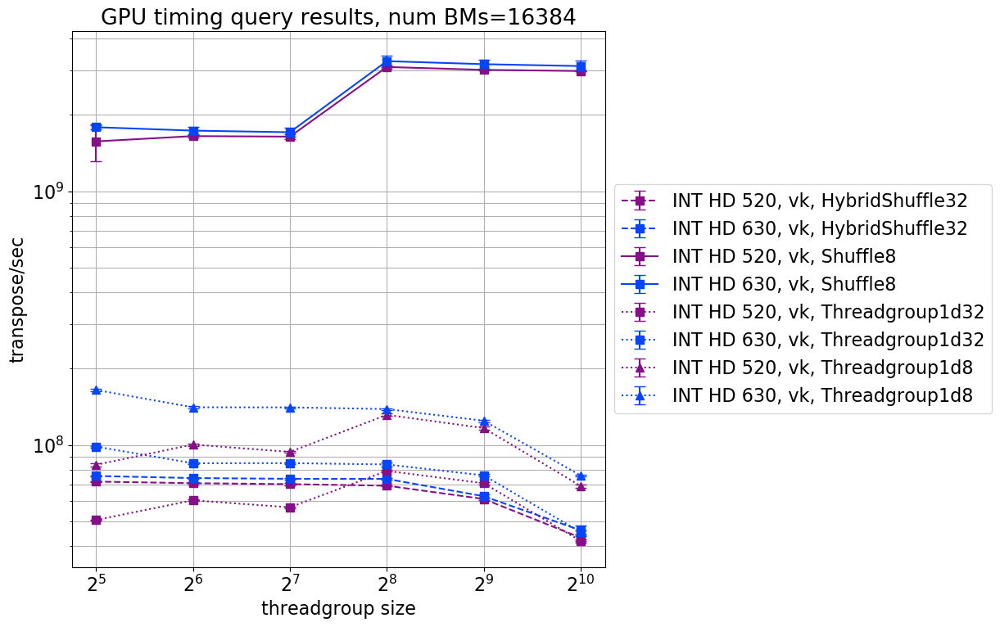

Solving problems on a GPU requires breaking it up into "primitives". Some primitives can naturally be executed in parallel, but others require coordination between the GPU's threads. An example of a primitive which requires coordination between threads for execution is the 
transposition of a square bitmap matrix. In piet-gpu, the bitmap represents a boolean matrix storing whether object `i` interacts with 
tile `j`. This post will examine the performance of this transposition task in detail. 

The type of inter-thread coordination required for the bitmap transposition task depends on how the problem is approached, either: 

1. (the threadgroup approach) the read/write access to a centrally stored (in threadgroup shared memory) bitmap must be coordinated between  threads, or 
2. (the subgroup approach) if the bitmap is stored in a distributed manner amongst the registers of the threads, then data must be shuffled  around between these registers to perform transposition. 

The threadgroup approach provides a programmer with a flexible interface through which stored data in threadgroup shared memory can be 
accessed and manipulated, and this interface is widely supported by hardware, graphics APIs, and shader languages. On the other hand, in the 
subgroup approach, a programmer has a limited interface available for interacting with stored data in the registers of threads within a 
subgroup, and this is interface is not available in older hardware, and not uniform amongst modern graphics APIs and shader languages. For 
example, HLSL and DX12 do not make the shuffle intrinsic available. 

The subgroup approach is appealing because of amazing performance when reading/writing between data stored in subgroup's thread registers. 
Threadgroup shared memory, in comparison, has poorer performance:

Is the performance gain from the subgroup approach worth it, given its downsides? Let's find out!

## Performance of threadgroup approach vs. subgroup approach

To compare performance, we calculate from our timing results the number of bitmap transpositions performed per second. Let's plot this rate with respect to varying threadgroup size:

What jumps out is that while the the subgroup kernel (`Shuffle32`) outperforms the threadgroup-based kernel (`Threadgroup1d32`) on both the AMD device and Nvidia devices, the effect is particularly pronounced on Nvidia devices. On the AMD device, the performance gain is marginal, suggesting that threadgroup shared memory is remarkably fast on AMD devices. Furthermore, effective utilization of the Nvidia RTX 2060 (a high end Nvidia GPU) for the bit matrix transposition task with respect to the Nvidia GTX 1060 relies on using SIMD techniques. 

We can also plot transposition rate versus varying number of bitmaps uploaded for transposition. Varying the payload size effectively varies how many threads are dispatched (theoretically, but not necessarily actually, since the device might not have that many threads available) for the compute task. So, it can tell us:
* (at low dispatch size) the relative performance of a single threads on a particular device with respect to that of another device
* (at increasing dispatch size) the maximum number of threads the device is able to muster, before being forced to divvy up tasks between this number.

An important observation is the number of threads dispatched when performance begins to start saturating. This gives us an indication of relatively how many threads a device can actually bring to bear on the problem at hand. So, while Nvidia GTX 1060's lanes individually outperform those of the AMD RX 570's, it cannot muster as many lanes as the AMD device can at one time. Thus, the AMD device can achieve higher transposition rates than the Nvidia device, when dealing with large payloads.   

Comparing Nvidia devices alone, individual thread performance between the Nvidia GTX 1060 (mid-tier GPU) and the Nvidia RTX 2060 (high end GPU) is comparable. But, just like the AMD RX 570, at large payload sizes, the RTX 2060 begins to dominate as it can muster many more threadsthan the GTX 1060.  

## Intel devices, hybrid shuffles, and 8x8 bitmap transpositions

On the Intel devices, we could not run `Shuffle32`, as we could not guarantee that the compiler would choose a subgroup size of 32 (it can choose a logical size between 8 and 32). However, since our transposition algorithm transposes a bitmap using a recursive algorithm, we could write a hybrid kernel which uses subgroup shuffles only for the lower order transpositions requiring a subgroup size of 8, and threadgroup-based transpositions otherwise:

We are surprised to find that the hybrid kernel underperformed the threadgroup kernel on Intel devices. On the dedicated devices, the hybrid shuffle behaved as we expected, with performance middling between threadgroup and shuffle kernels:

We do not know why the hybrid shuffle kernel underperforms on Intel devices. If you have insight on this issue, we'd love to know!

Another thing we could do on Intel is to transpose 16 8x8 bit matrices using subgroup shuffles alone; 16 8x8 bit matrices fit inside one 32x32 bit matrix, so we need not fiddle with our data representation or reported performance metric (transpose/sec) too much. Just consider am unqualified transpose in the 8x8 setting to be be the operation of transposing 16 8x8 bit matrices. The `Shuffle8` kernel has astonishingly good performance: 

Note that this is not because the `Shuffle8` kernel is simply doing less work, since the `Threadgroup1d8` kernel is not remarkably more performant than the `Threadgroup1d32` kernels on Intel devices. Furthermore, `Shuffle8` kernels are also not remarkably more performant than `Shuffle32` kernels on AMD and Nvidia devices:

It is very interesting to note that pure-shuffle 16x8x8 bit matrix transposition performance on Intel is around the same order of magnitude as 16x8x8 pure-shuffling on Nvidia or AMD devices!

Now, let's look at the performance of the Intel devices with respect to changing payload size. As we might expect, Intel devices are able to muster fewer lanes than the dedicated GPUs, as their performance begins saturate out earlier than the dedicated devices.  

The picture looks similar if we restrict our attention entirely to transposition of 16x8x8 matrices, except for the stand-out performance of the `Shuffle8` kernel on Intel:

