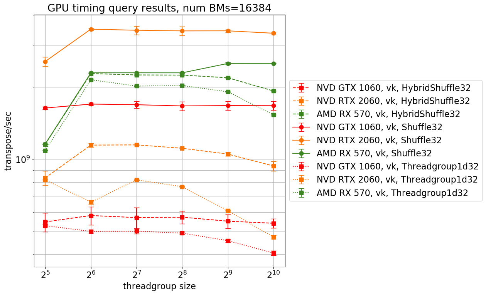
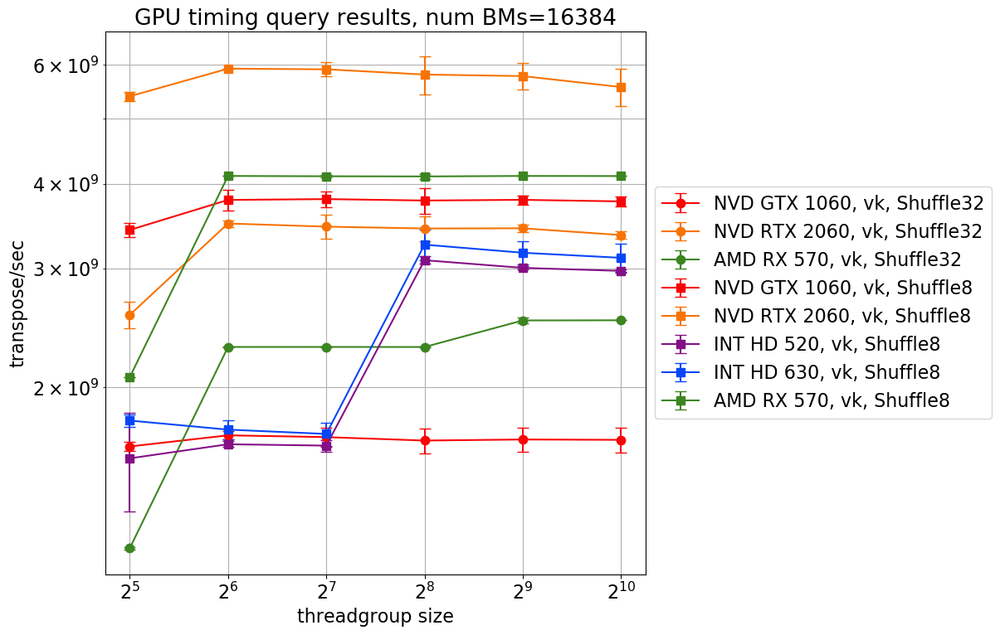

Executing a task on a GPU often requires breaking it up into "primitives". Some primitives can naturally be executed in parallel, but others require coordination between the GPU's threads. An example of such a primitive is the transposition of a square bitmap matrix, a necessary step in the execution of a GPU-compute based 2D renderer. The bitmap represents a boolean matrix storing whether object `i` interacts with tile `j`. 

To transpose the bitmap, threads can coordinate in two ways:

1. (the threadgroup approach) coordinate read/write access to a central location ("threadgroup shared memory"), where the bitmap is stored. 
2. (the subgroup approach) coordinate data swaps amongst themselves, as the bitmap is stored in a distributed manner in their registers.

Threadgroups are well supported by graphics APIs and shader languages, and provide a programmer with a flexible interface through which data stored in threadgroup shared memory can be manipulated. 

On the other hand, subgroups ("wavefronts" in DX12-land, and "warps" in CUDA-land) offer better performance. This is due to the low latency of read/write operations on the threads' registers, in comparison to read/write operations on threadgroup shared memory:

Subgroups are also likely to be the way of the future. Threadgroups are based on an SPMD model (single program, multiple dispatch), but most GPUs are not SPMD devices. Subgroups are based on the reality that most GPUs are SIMD (single instruction, multiple dispatch) devices. (A must read for this is: [SPMD is not Intel's cup of tea](http://www.joshbarczak.com/blog/?p=1120).)

However, the subgroup approach struggles with portability: it is not supported or only partially supported on older hardware and APIs. Even modern shader languages do not uniformly support subgroup operations; for example HLSL with SM 6.0 does not provide the subgroup shuffle intrinsic. 

Here's some relevant resources for those who'd like to learn more about subgroups:
* [the Vulkan subgroup tutorial](https://www.khronos.org/blog/vulkan-subgroup-tutorial)
* [Vulkan Subgroup Explained, by Daniel Koch](./ref-docs/06-subgroups.pdf) ([direct link](https://www.khronos.org/assets/uploads/developers/library/2018-vulkan-devday/06-subgroups.pdf)), also provides a table comparing subgroup interface in GLSL vs. HLSL
* [AMD GCN Assembly: Cross-Lane Operations](https://gpuopen.com/amd-gcn-assembly-cross-lane-operations/)
* [Using CUDA Warp-Level Primitives](https://devblogs.nvidia.com/using-cuda-warp-level-primitives/)
* [GPU resources collection](https://raphlinus.github.io/gpu/2020/02/12/gpu-resources.html)

So, when will it be relatively painless to use subgroups? What is the performance improvement like over threadgroups, and how device dependent is it?

## Performance of threadgroups vs. subgroups

We wrote kernels using threadgroup and subgroups to solve the bitmap transposition problem. In the [threadgroup kernel](https://github.com/bzm3r/transpose-timing-tests/blob/master/kernels/templates/transpose-Threadgroup1d32-template.comp) (referred to as `Threadgroup1d32`), each threadgroup transposes some number of 32x32 bitmaps, depending on the size of the threadgroup specified by the programmer (smallest threadgroup size is 32, so 1 bitmap matrix). In the [subgroup kernel](https://github.com/bzm3r/transpose-timing-tests/blob/master/kernels/templates/transpose-Shuffle32-template.comp) (referred to as `Shuffle32`), each subgroup transposes a 32x32 bitmap. While the number of threadgroups can be specified by the programmer, the number of subgroups in a threadgroup depends upon the subgroup size, which is hardware specific. As a general rule of thumb, Nvidia devices have subgroups with 32 threads (1 bitmap matrix), while AMD devices have subgroups with 64 threads (2 bitmap matrices). 

To compare performance, we calculate from our timing results the number of bitmap transpositions performed per second. Let's plot this rate with respect to varying threadgroup size. This chart shows results from `Threadgroup1d32` and `Shuffle32` kernels, on 3 different GPUs.

We see something interesting right away: while the subgroup kernel outperforms the threadgroup kernel on both the AMD device and Nvidia devices, the effect is particularly pronounced on Nvidia devices. On the AMD device, the performance gain is marginal, suggesting that threadgroup shared memory read/write access is remarkably fast on AMD devices.

**Mystery:** why is AMD RX 570's threadgroup shared memory competitive in performance with subgroup registers?

We can also plot transposition rate versus varying number of bitmaps (payload size) uploaded for transposition. Changing payload size varies the number of threads dispatched for the compute task, and can then provide the following information:
* (at low dispatch size) the relative performance of a single thread on a particular device with respect to that on another device;
* (at increasing dispatch size) the maximum number of threads the device can muster, after which it is must queue up tasks to wait for free threadgroups/subgroups. 

In the above graph, note carefully the number of dispatched threads at which performance begins to flatten out. This is the maximum number of threads available on the device. So, while Nvidia GTX 1060's threads individually outperform those of the AMD RX 570's (better performance at low number of dispatched threads), it has less available than the AMD device. Thus, the AMD RX 570 achieves higher transposition rates at large payload sizes.

Comparing Nvidia devices alone, individual thread performance between the Nvidia GTX 1060 (midrange GPU) and the Nvidia RTX 2060 (high end GPU) is comparable. However, since the RTX 2060 has many more threads available, it dominates the GTX 1060 when given large payloads.

## Intel devices, hybrid shuffles, and 8x8 bitmap transpositions

Recall that a programmer can easily control the size of a threadgroup, but is at the mercy of the hardware for subgroup sizes. On Intel devices, this problem is especially troublesome, since they physical subgroup size of 8, but can simulate subgroup sizes of 16 and 32. This choice of logical subgroup size is left up to the shader compiler, unless the programmer uses the `VK_EXT_subgroup_size_control` extension for GLSL. Sadly, the [`VK_EXT_subgroup_size_control`](https://www.khronos.org/registry/vulkan/specs/1.2-extensions/man/html/VK_EXT_subgroup_size_control.html) extension is not widely supported by Intel drivers. 

> Side note: [vulkan.gpuinfo.org](https://vulkan.gpuinfo.org/) is a good source for checking out which Vulkan extensions a particular device driver supports, and how well supported an extension is. To check out this info, click on `Extensions` in the top bar, and type in the name of the extension you are interested in (e.g. `VK_EXT_subgroup_size_control`). Note that `VK_EXT_subgroup_size_control` isn't supported by most devices, and the situation is particularly woolly on mobile.

Therefore, we tried a "hybrid" kernel specifically designed for Intel devices, which mixes using threadgroups and subgroups. Our implementation of matrix transposition executes `lg(n)` (n being the number of bits in the bitmap) "block swap operations". First, 16x16 blocks of the 32x32 matrix are swapped with their opposing neighbours, then 8x8 blocks are swapped, and so on. To do a N/2 x N/2 block swap, you need at least N threads in a subgroup/threadgroup. 

Since the minimum subgroup size on Intel devices is 8, we can always do 4x4 and smaller block swaps via subgroup operations. We call a hybrid threadgroup-subgroup kernel which does this `HybridShuffle32`. It is possible to be smarter, if we can determine which subgroup size was chosen by the shader compiler, then more of the block swap operations could be done using subgroups. Subgroup size information should be available to kernels via the `gl_SubgroupSize` constant. This adaptive version of the hybrid threadgroup-subgroup kernel is called `HybridShuffleAdaptive32`. 

When trying this out, we stumbled into an issue: the `gl_SubgroupSize` variable reports only the maximum logical size of a subgroup (32), instead of the size selected by the shader compiler. To get around this issue, we calculated subgroup size as [`gl_WorkgroupSize/gl_NumSubgroups`](https://github.com/bzm3r/transpose-timing-tests/blob/a78b46523cecd5483ea154ccc34080f581dda413/kernels/templates/transpose-HybridShuffleAdaptive32-template.comp#L51). 

Remember that since threadgroup shared memory access is expensive compared to subgroup register access, we expect the hybrid approach to be better than a pure threadgroup approach. Here's what the results are:

Surprise! The hybrid kernel underperforms compared to the pure threadgroup kernel on Intel HD 630. The adaptive hybrid kernel has worse performance than the simple hybrid kernel. The Intel HD 520 results are frankly weird, since the hybrid kernel does perform better at lower threadgroup sizes, but at larger threadgroup sizes, the situation becomes similar to that of the Intel HD 630. 

To check out the situation on dedicated devices, we tested `HybridShuffle32` (the non-adaptive hybrid kernel):

More like what we expected: hybrid shuffle has performance middling between threadgroup and subgroup kernels. However, given that we are working with a conceptual model which assumes threadgroup shared memory operations to be very expensive in comparison to subgroup operations, we would expect the hybrid kernel to do much better than the threadgroup kernel, since it does 3 out of 5 the block swap operations using the subgroup approach. 

**Mystery:** why does the hybrid threadgroup-subgroup kernel perform worse than the pure threadgroup kernel on Intel devices? Why does the adaptive hybrid kernel have worse performance than the simple hybrid kernel? How can we explain the poor performance of the threadgroup approach at low threadgroup sizes on Intel HD 520?

There is a way to transpose bitmap matrices using only subgroup operations on Intel: transpose smaller matrices! Since the physical subgroup size on Intel devices is 8, let's transpose 8x8 bit matrices using only subgroup operations. Note that 16 8x8 bit matrices fit inside one 32x32 bit matrix, so we need not fiddle with our data representation or reported performance metric (transpose/sec) too much. Just consider an unqualified transpose in the 8x8 setting to be be the operation of transposing 16 8x8 bit matrices at once, by one threadgroup, instead of 32x32 bit matrix. The `Shuffle8` kernel has impressive performance on Intel devices:

Note that this is not because the `Shuffle8` kernel is simply doing less work, since the `Threadgroup1d8` kernel (which does the same work as `Shuffle8`, except using subgroups) is not significantly more performant than the `Threadgroup1d32` kernel. Furthermore, `Shuffle8` kernels are also not significantly more performant than `Shuffle32` kernels on AMD and Nvidia devices:

Wow! Performance of pure-subgroup 16x8x8 bit matrix transposition on Intel is at the same order of magnitude as pure-subgroup 16x8x8 bit matrix transposition on Nvidia or AMD devices!

Now, let's look at the performance of the Intel devices with respect to changing payload size. As we might expect, Intel devices are able to muster fewer threads than the dedicated GPUs, and their performance begins to saturate for smaller payloads compared to the dedicated devices.  

This plot also reveals that Intel devices have less available parallelism for threadgroup shared memory than for subgroup operations as the threadgroup kernel's performance begins to saturate before the subgroup kernel's performance. This effect is expected, as the hardware shares a relatively limited number of shared memory subsystems per "slice" of execution units ([see Wikichip page on Gen9 microarchitecture](https://en.wikichip.org/wiki/intel/microarchitectures/gen9#Gen9)). A plot showing only 8x8 transposition results cleanly shows the parallelism difference between the two approaches on Intel devices.

## A subgroup kernel using the ballot intrinsic

Recall that subgroup operations are not supported uniformly by modern shader languages. In particular, the subgroup kernels presented so far rely heavily on the subgroup shuffle intrinsic, which is not available in HLSL. See the [test on Tim Jones' shader-playground](http://shader-playground.timjones.io/63db661366c97e9d1e0b5e05fa5d89c2), and [relevant DXC issue](https://github.com/microsoft/DirectXShaderCompiler/issues/2692).

Since HLSL does support the subgroup ballot intrinsic, we explored the performance of [a kernel](https://github.com/bzm3r/transpose-timing-tests/blob/master/kernels/templates/transpose-Ballot32-template.comp) based on the ballot intrinsic compared to those using the shuffle intrinsic. The ballot approach is only relevant to 32x32 bitmap transpositions, due to how we have structured our data, so we are going to look at its performance only on the discrete (AMD/Nvidia) GPUs:

`Ballot32` kernel performance is poor. Part of the poor performance can be explained by the fact that  the ballot-based kernel requires on the order of n (n being the number of bits in the matrix) instructions to execute a transpose, while the block-swap-based kernels (threadgroup or subgroup) require only on the order of lg(n) instructions. Another issue is divergence: the ballot kernel makes heavy use of branching. Since GPUs are fundamentally SIMD machines, threads which diverge from others (i.e. want to execute different instructions) due to branching are temporarily inactivated, until the other threads complete execution of their instruction. Thus, divergence should be avoided as much as possible, as it disrupts parallelism. 

## Conclusion

GPUs are, at their core, [SIMD](https://en.wikipedia.org/wiki/SIMD) devices. Traditionally, graphics APIs and shader languages do not make this apparent to the programmer, and instead provide the threadgroup abstraction, which assumes that the underlying device is SPMD. However, in the past few years, modern graphics APIs and shader languages have been increasingly exposing this underlying truth via subgroup (Vulkan)/wavefront (DX12)/warp (CUDA) operations.
 
Making a decision between using the threadgroups and subgroups is not straightforward. While using subgroups should allow for faster computations, threadgroup approaches are easy to program, and reliably portable. This post is meant to help guide a decision between using subgroups vs. threadgroups.

Our key findings are:

1. subgroup performance gains are device dependent: marginal on our AMD device, significant on our Nvidia devices, and dramatic on our Intel devices;  
2. it can be difficult to write subgroup kernels for Intel, since it is not yet easy to force a particular subgroup size, and a hybrid subgroup+threadgroup approach has surprisingly poor performance;
3. if you're writing kernels using HLSL, then you may be missing the subgroup intrinsics necessary for a performant implementation of your kernel. 

So, if performance matters, you’re okay with supporting a narrow set of hardware, and are willing to use GLSL + Vulkan (or CUDA?), then the subgroup approach is the winner. 

Finally, some of our observations are mysterious to us. These are marked with `Mystery:` (CTRL+F for it). If you think you can shed light on these mysteries, we'd love to hear!
