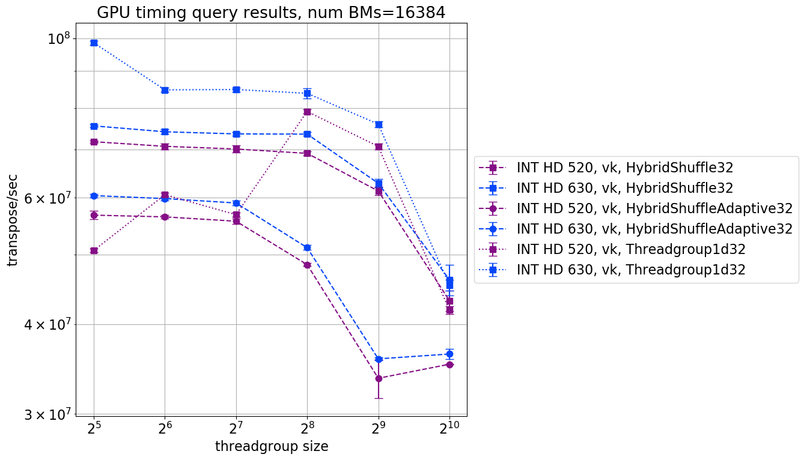
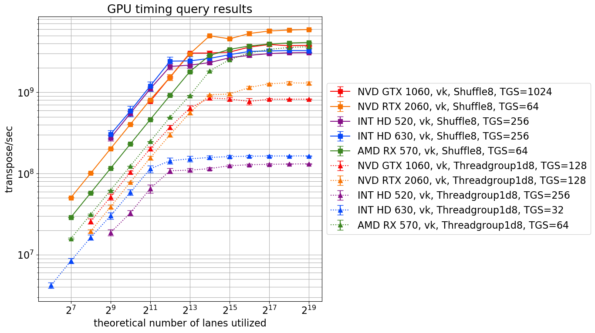

Solving a problem on a GPU often requires breaking it up into "primitives". Some primitives can naturally be executed in parallel, but others require coordination between the GPU's threads. An example of a primitive which requires coordination between threads for execution is the transposition of a square bitmap matrix. In piet-gpu, the bitmap represents a boolean matrix storing whether object `i` interacts with tile `j`. This post will examine the performance of this transposition task in detail. 

There are two main approaches to inter-thread coordination for the bitmap transposition task: 

1. (the threadgroup approach) the read/write access to a centrally stored (in threadgroup shared memory) bitmap must be coordinated between threads, or 
2. (the subgroup approach) if the bitmap is stored in a distributed manner amongst the registers of the threads, then data must be shuffled around between these registers to perform transposition. 

The threadgroup approach provides a programmer with a flexible interface through which stored data in threadgroup shared memory can be 
accessed and manipulated, and this interface is widely supported by hardware, graphics APIs, and shader languages. The subgroup approach offers better performance, but also challenges with portability (it is not supported or only partially supported on older hardware and APIs). ***[BM: Following is an attempt to clarify previous incorrectly worded statement]*** Even modern shader languages do not uniformly support subgroup intrinsics; for example HLSL with SM 6.0 does not provide the subgroup shuffle intrinsic. 

~~***[Point to Vulkan subgroup tutorial. Some of the audience will know this, others won't. So this is an opportunity to cut'n'paste various GPU resource lists :) Also feel free to link my blog post for general background.]***~~

Here's some relevant resources for those who'd like to learn more:
* [the Vulkan subgroup tutorial](https://www.khronos.org/blog/vulkan-subgroup-tutorial)
* [Vulkan Subgroup Explained, by Daniel Koch](./ref-docs/06-subgroups.pdf) ([direct link](https://www.khronos.org/assets/uploads/developers/library/2018-vulkan-devday/06-subgroups.pdf)), also provides a table comparing subgroup interface in GLSL vs. HLSL
* [AMD GCN Assembly: Cross-Lane Operations](https://gpuopen.com/amd-gcn-assembly-cross-lane-operations/)
* [Using CUDA Warp-Level Primitives](https://devblogs.nvidia.com/using-cuda-warp-level-primitives/)
* [GPU resources collection](https://raphlinus.github.io/gpu/2020/02/12/gpu-resources.html)

The subgroup approach is appealing because of significantly better performance when transferring between data stored in subgroup's thread registers. Threadgroup shared memory, in comparison, has poorer performance:

Is the performance gain from the subgroup approach worth it, given its downsides? Let's find out!

## Performance of threadgroup approach vs. subgroup approach

~~***[A few sentences describing what this code does. Each threadgroup transposes some number, 1 in the least case, of 32x32 matrices. The code is at [point to repo].]***~~
We wrote kernels using threadgroup and subgroup approaches to solve the bitmap transposition problem. In the [threadgroup kernel](https://github.com/bzm3r/transpose-timing-tests/blob/master/kernels/templates/transpose-Threadgroup1d32-template.comp) (referred to as `Threadgroup1d32`), each threadgroup transposes some number, 1 in the least case, of 32x32 bitmaps (depending on the size of the threadgroup). In the [subgroup kernel](https://github.com/bzm3r/transpose-timing-tests/blob/master/kernels/templates/transpose-Shuffle32-template.comp) (referred to as `Shuffle32`), each subgroup transposes a 32x32 bitmap, with the number of subgroups in a threadgroup depending upon the subgroup size (hardware-specific) and the selected threadgroup size. 

To compare performance, we calculate from our timing results the number of bitmap transpositions performed per second. Let's plot this rate with respect to varying threadgroup size. This chart shows **results from** `Threadgroup1d32` and `Shuffle32` kernels, on 3 different GPUs.

What jumps out is that while the the subgroup kernel outperforms the threadgroup-based kernel on both the AMD device and Nvidia devices, the effect is particularly pronounced on Nvidia devices. On the AMD device, the performance gain is marginal, suggesting that threadgroup shared memory is remarkably fast on AMD devices. Note also that the Nvidia RTX 2060 (a high end Nvidia GPU) begins outperform the Nvidia GTX 1060 only when using the subgroup approach. ~~***[I didn't quite get what this last sentence is supposed to mean; maybe delete?]***~~ **[BM: tried to clarify this; does it work?]**

We can also plot transposition rate versus varying number of bitmaps uploaded for transposition. Varying the payload size varies the maximum of how many threads are dispatched for the compute task. So, it can tell us:
* (at low dispatch size) the relative performance of a single threads on a particular device with respect to that of another device
* (at increasing dispatch size) the maximum number of threads the device is able to muster, before being forced to divvy up tasks between this number.

An important observation is the number of threads dispatched when performance begins to start saturating. This gives us an indication of relatively how many threads a device can actually bring to bear on the problem at hand. So, while Nvidia GTX 1060's lanes individually outperform those of the AMD RX 570's, it cannot muster as many lanes as the AMD device can at the same time. Thus, the AMD device can achieve higher transposition rates than the Nvidia device, when dealing with large payloads.   

Comparing Nvidia devices alone, individual thread performance between the Nvidia GTX 1060 (mid-tier GPU) and the Nvidia RTX 2060 (high end GPU) is comparable. But, just like the AMD RX 570, at large payload sizes, the RTX 2060 begins to dominate as it can muster many more threads than the GTX 1060.  

## Intel devices, hybrid shuffles, and 8x8 bitmap transpositions

A major difference between threadgroup and subgroup approaches is that the programmer is in control of the size of a threadgroup (subject to a maximum which is usually 1024 threads), but is at the mercy of the hardware, and sometimes the shader compiler, for threadgroup sizes. This problem is especially troublesome on Intel, both because the subgroup size is usually smaller (8, 16, or 32) compared with 32 on Nvidia and 64 on AMD, but also because it varies based on heuristics applied by the compiler.

In fact, the situation on Intel is even worse, as there is no good way to even query the subgroup size for a given compute pipeline. The `subgroupSize` from the `VkPhysicalDeviceSubgroupProperties` query reports only a default value (32 on the hardware and drivers tested). Even worse, the `gl_SubgroupSize` variable, available within shader code, reports the same default value instead of the actual number of invocations within the subgroup. This behavior seems to technically comply with the spec language, but is not useful, to say the least.

**Hopefully the situation on Intel will get better, once the [`VK_EXT_subgroup_size_control`](https://www.khronos.org/registry/vulkan/specs/1.2-extensions/man/html/VK_EXT_subgroup_size_control.html) extension becomes widely supported by Intel drivers, but for the time being code has to deal with the situation. [vulkan.gpuinfo.org](https://vulkan.gpuinfo.org/) is a good source for checking out which Vulkan extensions a particular device driver supports, and how well supported, in general, an extension is. To check out the latter click on `Extensions` in the top bar, and type in the name of the extension you are interested in (e.g. `VK_EXT_subgroup_size_control`). Note that `VK_EXT_subgroup_size_control` isn't commonly supported, and the situation is particularly woolly on mobile.**

Our implementation of matrix transpose performs `lg(n)` **(n being the number of bits in the bitmap)** shuffle operations in sequence, each doing a partial transpose in parallel of a chunk of bits. Since threadgroup memory accesses are expensive, we explored a hybrid approach where some of the shuffles are done using subgroups, while the ones that interact in chunks larger than the subgroup size use threadgroup shared memory.

We are surprised to find that the hybrid kernel underperformed the threadgroup kernel on Intel devices. On the dedicated devices, the hybrid shuffle had performance middling between threadgroup and shuffle kernels, but still not as good as would have been predicted from a model assuming that the threadgroup memory operations and barriers are the most expensive operations:

We do not know why the hybrid shuffle kernel underperforms on Intel devices. If you have insight on this issue, we'd love to know!

Another thing we could do on Intel is to transpose 16 8x8 bit matrices using subgroup shuffles alone; 16 8x8 bit matrices fit inside one 32x32 bit matrix, so we need not fiddle with our data representation or reported performance metric (transpose/sec) too much. Just consider an unqualified transpose in the 8x8 setting to be be the operation of transposing 16 8x8 bit matrices. The `Shuffle8` kernel has impressively good performance: 

Note that this is not because the `Shuffle8` kernel is simply doing less work, since the `Threadgroup1d8` kernel **(which does the same work as `Shuffle8`, except using threadgroups)** is not significantly more performant than the `Threadgroup1d32` kernels on Intel devices. Furthermore, `Shuffle8` kernels are also not significantly more performant than `Shuffle32` kernels on AMD and Nvidia devices:

It is very interesting to note that pure-shuffle 16x8x8 bit matrix transposition performance on Intel **is at the same order of magnitude** as 16x8x8 pure-shuffling on Nvidia or AMD devices!

Now, let's look at the performance of the Intel devices with respect to changing payload size. As we might expect, Intel devices are able to muster fewer lanes than the dedicated GPUs, as their performance begins saturate out earlier than the dedicated devices.  

This plot also reveals that Intel devices have less available parallelism for threadgroup shared memory than for subgroup operations. This effect is expected, as the hardware shares a relatively limited number of shared memory subsystems per "slice" of execution units **([see Wikichip page on Gen9 microarchitecture](https://en.wikichip.org/wiki/intel/microarchitectures/gen9#Gen9)). A plot showing only 8x8 transposition results cleanly shows the parallelism difference between the two approaches on Intel devices.**

## A ballot based subgroup approach

An additional problem with subgroups is that not all subgroup operations are supported on all hardware. In particular, our matrix transposition code relies heavily on shuffle operations, and these are not present at all either in DX12 or in HLSL (even when compiling from HLSL to SPIR-V). See the [test on Tim Jones' shader-playground](http://shader-playground.timjones.io/63db661366c97e9d1e0b5e05fa5d89c2), and [relevant DXC issue](https://github.com/microsoft/DirectXShaderCompiler/issues/2692).

Since HLSL does support the ballot intrinsic, we explored the performance of [a kernel](https://github.com/bzm3r/transpose-timing-tests/blob/master/kernels/templates/transpose-Ballot32-template.comp) based on the ballot intrinsic compared to those using the shuffle intrinsic. The ballot approach is only relevant to 32x32 bitmap transpositions, due to how we have structured our data, so we are going to look at performance on discrete GPUs.

`Ballot32` kernel performance is poor. The loss in performance is particularly pronounced on the Nvidia devices. Part of the poor performance can be ascribed to the O(n) nature of the ballot-based kernel (n being the number of bits in the matrix), while the shuffle-based kernel is O(lg(n)). However, another issue is also due to the heavy branching (with poor divergence) required in the `Ballot32` kernel.

## Conclusion

Making a decision between using the threadgroup approach and the subgroup approach is not straightforward, but this post is meant to provide some data to guide this choice. Some key observations are:

1. performance gain is very device dependant, from being marginal on our AMD device, to significant on Nvidia devices, and dramatic on Intel devices;  
2. it can be difficult to write subgroup kernels for Intel, since it is not easy to force a particular subgroup size, and for some reason, hybrid approaches seem to have poor performance;
3. if you're writing kernels using HLSL (as we are, for piet-dx12), then you may be missing the subgroup intrinsics necessary for a performant implementation of your kernel. 

Even though the subgroup approach can provide wins, there are caveats, while the threadgroup approach is easy to use, portable and reliable. So, if performance matters, and you are only supporting a narrow set of hardware, the subgroup approach may well be the easy choice. Otherwise,  Finally, we have two questions we do not know the answer to, but would like to know:

* why does the hybrid approach have poor performance vs. the pure threadgroup approach on Intel devices?
* why does AMD's threadgroup shared memory seem to be as performant as subgroup register storage? 

