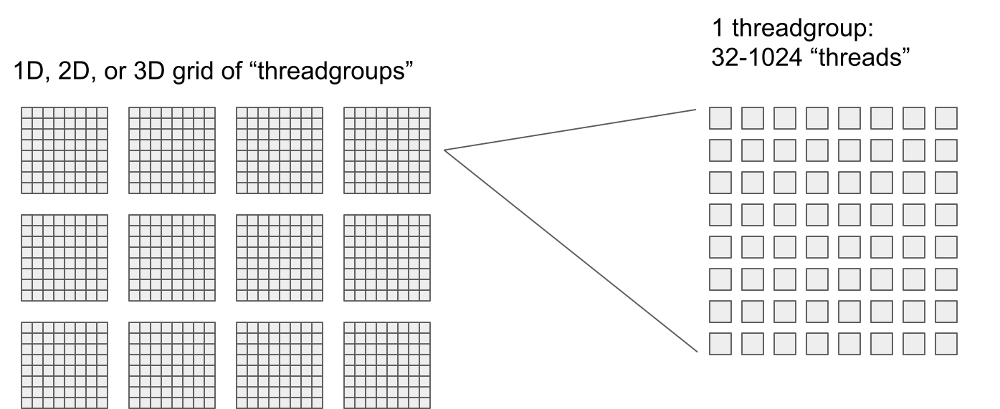
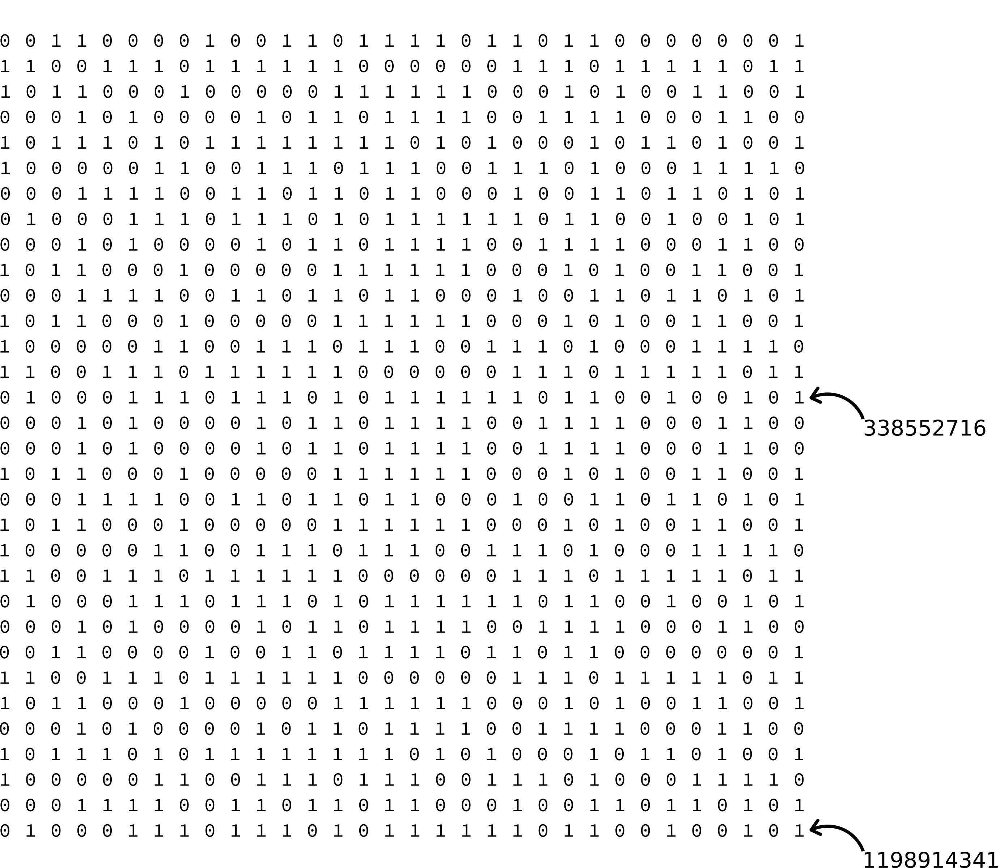
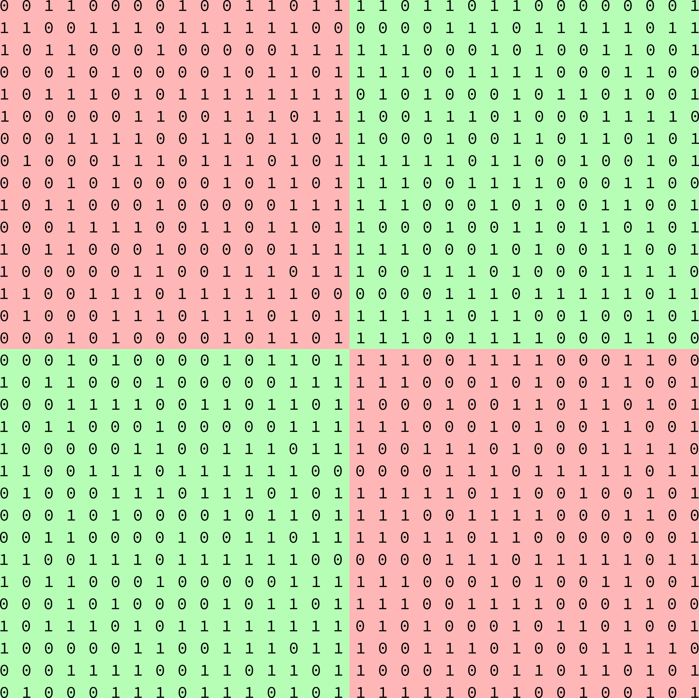
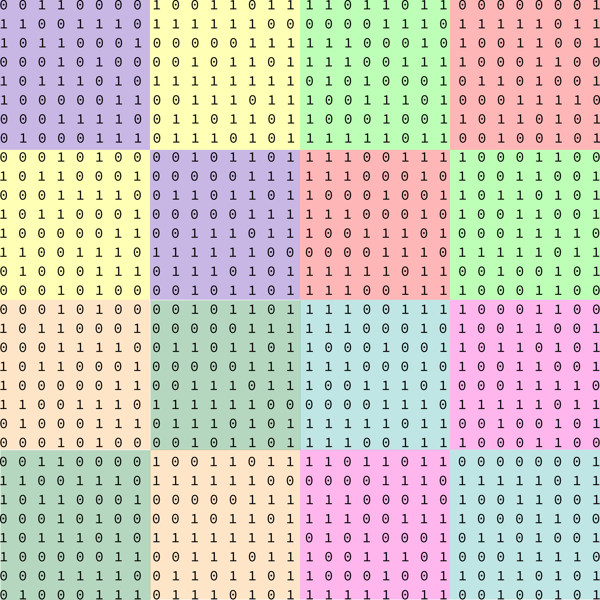

# Analyzing results from timing bit matrix  transpositions on the GPU

Raph Levien's planned performance improvements to [`piet-metal`]() will rely on efficiently transposing 32x32 bit matrices. Therefore, it will be of interest to examine the performance of programs designed to execute this task. In particular, in this post, we will investigate **time performance**. 

The bit matrix transposition problem can be addressed, broadly speaking, with two types of programs:
1. Classical **threadgroup** ("warp", "workgroup") based programs, relying on shared memory available to threads within the group.
2. SIMD ("subgroup", "wavefront") based programs relying on rapid sharing of registers associated with the lanes making up the SIMD group.

In general, we will see that the SIMD class of programs will outperform threadgroup-based programs. However, we will also see that the timing results reveal much about the underlying GPU hardware.

## Introduction to SIMD

In 1966, Michael J. Flynn proposed a classification of computer architectures which is eponymously referred to as "Flynn's taxonomy". There are four categories in this classification:
* Single Instruction stream, Single Data stream (SISD)
* Single Instruction stream, Multiple Data streams (SIMD)
* Multiple Instruction streams, Single Data stream (MISD)
* Multiple Instruction streams, Multiple Data streams(MIMD)

A computing device is SISD if at each [clock cycle](https://en.wikipedia.org/wiki/Clock_signal), it fetches an instruction from a single instruction stream, and data (for that instruction) from a single data stream. Such a device cannot work in parallel (at least in a useful way). 

A computing device is SIMD, if at each clock cycle, it fetches an instruction from a single stream, but fetches data from multiple streams, so that the fetched instruction can be executed simultaneously upon the data acquired from each stream. One way to create a SIMD device might be to group some processing units together so that they are all connected to the same instruction stream, but have their own data streams. Such a device can be meaningfully used to perform parallel computations. It is worth re-iterating that in a SIMD device, every processing unit must be executing the same instruction every cycle; only the data provided to the instruction may differ amongst the processing units.

MISD, and MIMD should be relatively straightforward to understand from the definition of SISD and SIMD. [Wikipedia provides a more complete explanation](https://en.wikipedia.org/wiki/Flynn%27s_taxonomy) of the categories in Flynn's taxonomy.

Flynn's taxonomy will not be considered useful in this article beyond providing an understanding of what is meant by SIMD. 

## Introduction to Threadgroups and Subgroups

Modern GPU hardware is not only complex, but many of the relevant details are also closed-source. Thus, to understand understand program performance, programmers must rely on abstractions of this hardware. These abstractions in turn are strongly influenced by APIs (e.g. OpenGL or Vulkan) specifying the interaction between hardware and application.

The commonly used mental model of GPU hardware sees a GPU's processors as essentially individual units ("threads
") which can also be divided into groups ("threadgroups"), where the size of these threadgroups can be set by the
 application
 . Special programs called "shaders" (or, in the context of general-purpose GPU computing, "kernels") are executed by each thread within the threadgroup. The instructions specified by the kernel are the same across the threads, but a thread can access different memory for these instructions to work upon. Furthermore, threadgroups can include branching control flow statements (e.g. if statements), which can also cause particular threads within a threadgroup to be executing different instructions than another thread, at any given time.



While this model captures the gist of a GPU's architecture, it is incomplete. To build a more refined mental model, one
 must start by
 considering how data flows within a GPU, i.e. understanding hierarchy within which GPU memory is organized.


Each thread has associated with it registers which store data using a [configuration of logic gates](https://en.wikipedia.org/wiki/Flip-flop_(electronics)) called a flip-flop. This storage is expensive in the energy required to maintain it, but powerful in terms of performance. However, its capacity is also quite small (**Question 0:** Why? Probably because we want to keep each thread close by on the chip, and the more of these we have, the hotter everything would get?). Direct access to these registers was unavailable to programmers until quite recently, when APIs began to expose them via subgroup operations.  

A subgroup is a group of threads which are tightly associated due to hardware architecture; the relevant side effect of this is that subgroup threads can access each others' registers efficiently. A change of terminology is in order: we will call threads within a subgroup "lanes", taking this terminology from the SIMD-world. The term "lane" is not overloaded by this decision, as a subgroup *is* a SIMD unit. Since a subgroup is a SIMD unit, all the lanes within a subgroup must be executing the same instruction. If due to branching statements two lanes within a subgroup must "diverge" (so that one would end up performing a different instruction than the other), then one of the lanes is temporarily made inactive. Thus, at all times, either a thread is inactive, or it is executing the same instruction as all active threads. 

One level up in the hierarchy, we have threadgroups, which can be profitably understood as a group of subgroups. Subgroups within a threadgroup have access to "threadgroup shared memory", allowing for data to be shared between subgroups. While threadgroup shared memory has greater storage capacity than registers, it also has lower bandwidth, and greater latency, making it less time-performant in comparison. Note that threadgroup shared memory storage is also register (flip-flop) based.

On the top, we have global memory, which unlike the lower levels in the hierarchy, uses capacitors (DRAM) as storage elements. Global memory is accessible to all threadgroups on a device, but given its performance characteristics, two threadgroups cannot meaningfully communicate with each other on useful timescales. If the threads within a threadgroup can pass send messages to each other with a day's delay, it may take up to 10 days for messages to pass between threadgroups. You wouldn't want to have your threads sitting around, twiddling their thumbs, in that time, and thus design your programs to minimize dependency on inter-threadgroup communication. 

## Transposing bit matrices

Before we jump into using our new-found understanding of threadgroups and subgroups to start writing kernels which transpose bit matrices, let us discuss how bit matrices will be reprsented in memory, and the general concept of the transposition algorithm for bit matrices.

### Memory representation 

Recall that we are interested in transposing 32x32 bit matrices. Note that an unqualified unsigned integer is 32 bits wide. Therefore, a 32x32 bit matrix can be represented as an array of 32 unsigned integers. 



**General algorithm.** The algorithm we use to transpose the bit matrix is recursive. Label the 32x32 matrix `M_32`, and consider its division into 4 16x16 sub-matrices ("blocks"):



16x16 blocks of the same colour are swapped with each other, giving us a new matrix `M_16`. Divide `M_16` up into 8x8 blocks:



Once again, blocks of the same colour are swapped with each other, giving us a new matrix, `M_8`. We repeat this procedure 3 more times: 4x4 blocks (produces `M_4` from `M_8`), 2x2 blocks (produces `M_2` from `M_4`), and 1x1 blocks (produces `M_1` from `M_2`).

For some hand-built intuition, start with a 4x4 matrix, labelled `M_4`. By hand, write down its transposition, and label that `T`. Produce `M_2` from `M_4`, and then `M_1` from `M_2`. Confirm that `M_1` and `T` are the same.  

## Parellelizing the recursive transposition algorithm. 

Note that when you are generating `M_16` from `M_32`, the `i`th row of `M_16` will depend upon the `(i + 16) % 32` row of `M_32`. When `0 <= i < 16`, `M_16[i] = M_32[i + 16] << 16 | M_32[i + 16] >> 16` (i.e. the first 16 bits of `M_32[i + 16]`) become the last 16 bits of `M_16[i]`, and the last 16 bits of `M_32[i + 16]` become the first 16 bits of `M_16[i]`. 

So, if you have 32 processors, the `i`th processor can read `M_32[(i + 16)%32]`, and "shuffle round" its bits, storing the result in a new array called `M_16`. The `i`th processor does its work independently of the other processors, so it is embarrassingly easy to parallelize this problem. Note that each processor will execute the exact same sequence of operations, but will have different input data (SIMD).

For the other cases, the concept is the same, but one must be more careful with the indexing, and the bit shifting. All of this is implemented most plainly in the threadgroup based kernel's "shuffle round" function [`shuffle_round`](https://github.com/bzm3r/transpose-timing-tests/blob/85937fc84ae7ba49210255e54059d844e847a1c9/kernels/templates/transpose-threadgroup1D-template.comp#L19). Given some thread `i`, figuring out which row's data it should read is done on [this line](https://github.com/bzm3r/transpose-timing-tests/blob/85937fc84ae7ba49210255e54059d844e847a1c9/kernels/templates/transpose-threadgroup1D-template.comp#L58).


**Aside:** for those unfamiliar with bitwise operations, please don't be afraid to understand the code. It will take some time, but the concepts are straightforward. Keep [Wolfram Alpha](https://www.wolframalpha.com/input/?i=BitAnd%5Bffff00_16%2C+ffff_16%5D) or [Rust Playground](https://play.rust-lang.org/?version=stable&mode=debug&edition=2018&gist=3db32d1ea9ff7b7e8a49a0b0b7292cf1) handy (I can't recommend Python, because it does not have unsigned integers, which causes all sorts of problems). Begin by carefully going through these points:
* (important) the [most significant bit](https://en.wikipedia.org/wiki/Bit_numbering#Most_significant_bit), the [least significant bit](https://en.wikipedia.org/wiki/Bit_numbering#Least_significant_bit), and [endianness](https://en.wikipedia.org/wiki/Endianness)
* (very important) bitwise operators [and, or, not and xor](https://en.wikipedia.org/wiki/Bitwise_operation#Bitwise_operators)
* (somewhat important) [hexadecimal numbers](https://en.wikipedia.org/wiki/Hexadecimal). Note that `0xf` is the  form of the integer with binary form `1111` (4 `1`s). In 32-bit form, `0xf` will be `00000000000000000000000000001111` (16 `0`s followed by 4 `1s`) The integer with 32-bit binary form of 16 `0s` followed by  get 16 `1`s, will be `0xffff`. What is `0x9`? What is `0xa`? 
* The modulo of `x` by number `y`, where `y` is a power of 2, is `x & (y - 1)` (`&` is bitwise and). Why is that? 
* Suppose that `y` is the `m`th power of 2 (`m >= 0`). Why is `x/y = x >> m` (`>>` is logical right shift)?
* What is the bitwise xor of various numbers between 0 and 31 (inclusive), by various other numbers between 0 and 31 inclusive? What patterns can you see? (The Rust playground link may be helpful.)

The kernels (for transposing [8x8](https://github.com/bzm3r/transpose-timing-tests/blob/master/kernels/templates/transpose-shuffle8-template.comp) or [32x32](https://github.com/bzm3r/transpose-timing-tests/blob/master/kernels/templates/transpose-shuffle32-template.comp) matrices) using the SIMD `subgroupShuffleXor` operation also follows the same concept, but the `^` (bitwise xor) operation happens within the `subgroupShuffleXor` instruction:
 ```
 uint shuffle_round(uint a, uint m, uint s) {
     uint b = subgroupShuffleXor(a, s); // XOR happens here
     uint c;
     if ((gl_SubgroupInvocationID & s) == 0) {
         c = b << s;
     } else {
         m = ~m;
         c = b >> s;
     }
     return (a & m) | (c & ~m);
 } 
```
Note that something quite tricky is happening in `uint b = subgroupShuffleXor(a, s);`. This function seems like it is invocation-specific, and that `subgroupShuffleXor`'s output will depend only on the values for `a` passed by *this* invocation. Recall that lanes execute instructions in lockstep, and that subgroup operations allow access between registers of lanes within a subgroup. So, `subgroupShuffleXor` can (and does) take as input the values of `a` stored in the registers of each lane. In other words, it is acting on a *vector* of `a` values. 
 
The hybrid kernel generates `M_16` and `M_8` using threadgroups, and `M_4` to `M_1` using subgroups. It is the only way in which we can use subgroups to some extent in transposing 32-bit matrices on Intel devices, where the subgroup size is variable between 32 and 8, but is guaranteed to be at least as large as 8.

The SIMD ballot kernel uses a much simpler algorithm: for the `i`th row, it asks for the `i`th bit of all the processors (from `0` to `31`) inclusive (i.e. it effectively computes the `i`th column using the `subgroupBallot` operation). It stores the result as the row of the transposed matrix.

## Why bother with SIMD (subgroups)?

Apart from the fact that the parallelization of the bit matrix transposition algorithm presented had a distinctly "Single Instruction Multiple Data" flavour to it, why else would we bother using subgroups? Well, for better performance. 

In the threadgroup kernel, a bit matrix is loaded into threadgroup shared memory, and this is then accessed by all threads in the group as they do their calculation. The GPU does have to organize reads of the lanes in the threadgroup from shared memory. 

On the other hand, in the SIMD-based kernels, a bit matrix (or two, if you are using an AMD machine with a subgroup size of 64) is loaded into the *fast* subroup-level registers. Lanes within the subgroup need not look up the data they need from threadgroup shared memory, but instead can take advantage of the close connection they have to the other registers in their subgroup. 

## Results

In the first experiment, the number of bit matrices uploaded is held constant, while the size of the threadgroup is changed between 32 (2<sup>5</sup>) and 1024 (2<sup>10</sup>):


### Intel HD 520

(References: [WikiChip](https://en.wikichip.org/wiki/intel/microarchitectures/gen9#Gen9))

This is a Skylake series chip released in 2015. This GPU utilizes the **Gen9 GT2** microarchitecture, which has two major components: the **Slice**, and the **Unslice**. The Slice is the computational heart of the GPU as it contains the computing units. The Unslice is essentially the interface between the Slice, and the outside world, although it does have some fixed function capabilities of its own; that is, it contains some specialized non-programmable hardware to execute common graphics related tasks. Importantly, the Unslice contains hardware which controlling the dispatch of instructions to the Slice.   

Each slice in a Gen9 GT2 architecture consists of 3 **subslices**, each with 8 **execution units**. An execution unit has access to 128 32-byte SIMD-8 registers. Let's unpack what "128 32-byte SIMD-8 registers" means: there are 128 registers, each of size 32 bytes. These 32 bytes are divided into 8 addressable elements (i.e. elements which can be referred to using a pointer). Note that (32 bytes)/(8 elements) = (4 bytes per element), so each element is (4 bytes)x(8 bits per byte) = (32 bits) wide. These 8 elements together form a "SIMD-8 vector". [Section 5.3.0](https://en.wikichip.org/w/images/a/a0/The-Compute-Architecture-of-Intel-Processor-Graphics-Gen9-v1d0.pdf)

An execution unit has 7 "threads". There is terminology overload here, since an Intel Gen9 thread *is not* the same as an abstract GPU thread making up a threadgroup. Therefore, to be careful, we will say that each execution unit has 7 "Gen9-threads". Furthermore, since each Gen9-thread is an instruction stream, we will choose to refer to them simply as such. Every clock cycle, the execution unit's **Gen-9 thread arbiter** can select up to 4 out of the 7 instruction streams from which to read instructions. 

An execution unit has 2 SIMD "floating point units" (FPUs), computation units which, contrary to their name, support both floating point and integer operations [Section 5.3.2](https://en.wikichip.org/w/images/a/a0/The-Compute-Architecture-of-Intel-Processor-Graphics-Gen9-v1d0.pdf). 

The shuffle and ballot kernels cannot be run on this device since they require a minimum subgroup size of 32, but it is not straightforward to force a subgroup size of 32 on Intel. It is worth noting that `gl_SubgroupSize` is  `32` on this device, even though the actual subgroup size can vary; thus, `gl_SubgroupSize` seems to give the maximum subgroup size a device can provide, rather than the actual subgroup size being provided. Although we cannot run the shuffle kernel, we can run a hybrid shuffle+threadgroup kernel, where `M_16` and `M_8` are generated using a threadgroup kernel, but `M_4` and below are generated using a subgroup kernel---note the mild performance improvement in the hybrid kernel. Key observations for the Intel HD 520:

| Observation  | Analysis |
| ------------- | ------------- |
| **threadgroup kernel:** a TG size of 64 (2<sup>6</sup>) provides the optimal transpose rate when using a TG kernel, but increasing the TG size beyond this decreases performance exponentially, reaching its worst at a size of 512 (2<sup>9</sup>) | ?  |
| **threadgroup kernel:** performance at TG sizes of 512 (2<sup>9</sup>) and 1024 (2<sup>10</sup>) is the same | ?  |
| **hybrid-shuffle kernel:** has mildly better performance than the TG kernel | ?  |
| **hybrid-shuffle kernel:** performance is essentially insensitive to TG size, but begins to drop off noticeably at TG sizes of 512 (2<sup>9</sup>) and 1024 (2<sup>10</sup>) | ? |

**AMD RX 570.** It is important to note than on AMD devices such as the RX 570, there are 64 lanes in a subgroup. Key observations for the AMD RX 570:

| Observation  | Analysis |
| ------------- | ------------- |
| **threadgroup kernel:** a TG size of 64 (2<sup>6</sup>) provides the optimal transpose rate when using a TG kernel, but increasing the TG size beyond this decreases performance exponentially | ?  |
| **threadgroup kernel:** performance at a TG size of 32 (2<sup>5</sup>) is noticeably worse than performance at a TG size of 64 (2<sup>6</sup>) | ?  |
| **hybrid-shuffle kernel:** has mildly better performance than the TG kernel | ?  |
| **hybrid-shuffle kernel:** performance is essentially insensitive to TG size, but begins to drop off noticeably at TG sizes of 512 (2<sup>9</sup>) and 1024 (2<sup>10</sup>) | ? |
