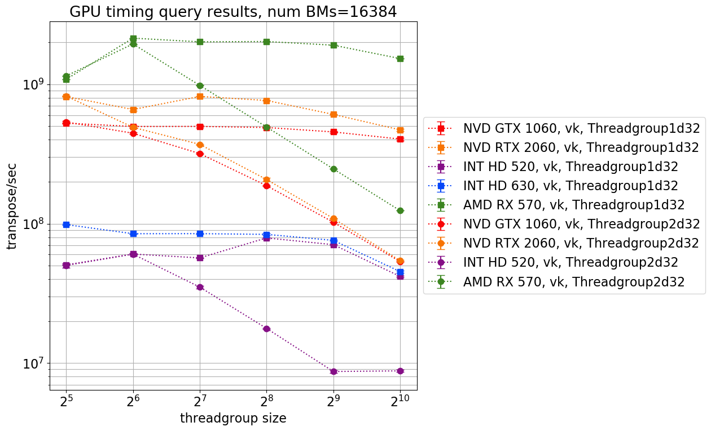
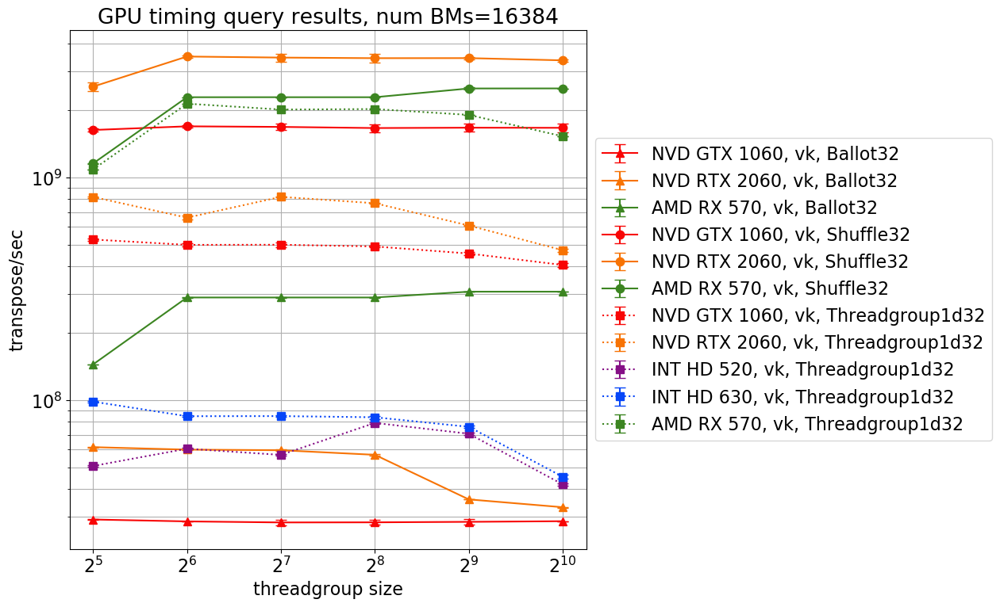
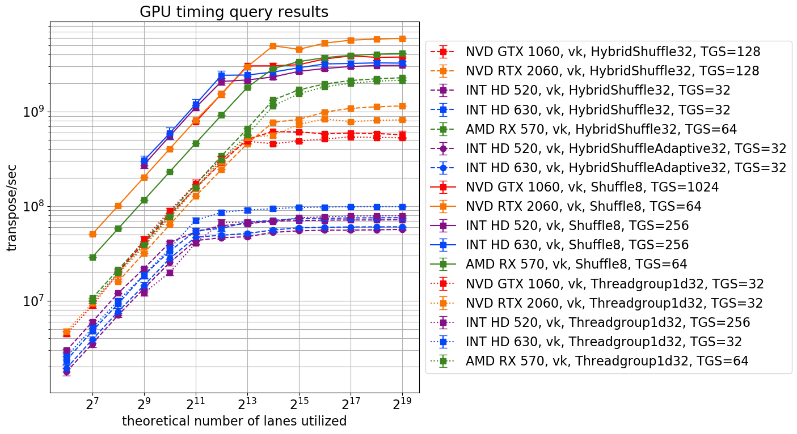

# Analyzing results from timing bit matrix  transpositions on the GPU

We are currently experimenting with using the GPU as a general purpose device for fast 2D rendering. In particular, one of our rendering kernels will need to quickly transpose 32x32 bit matrices.

In general, the bit matrix transposition problem can be addressed on the GPU using two types of programs:
 1. Classical **threadgroup** ("warp", "workgroup") based programs, relying on  shared memory available to processors ("threads") in the threadgroup.
 2. **SIMD** ("subgroup", "wavefront") based programs relying on rapid sharing  of register storage between processors ("lanes") in the SIMD group.
 
We studied how kernels which use SIMD technique compare in performance with "classical" threadgroup techniques. By performance, we mean specifically **time performance**: how quickly can matrices be transposed? Our results provide insight on how performance gains using SIMD techniques are dependent on choice of device, and choice of algorithm. 

## Introduction to SIMD

In 1966, Michael J. Flynn proposed a classification of computer architectures ("Flynn's taxonomy"). There are four categories in this classification:
* Single Instruction stream, Single Data stream (SISD)
* Single Instruction stream, Multiple Data streams (SIMD)
* Multiple Instruction streams, Single Data stream (MISD)
* Multiple Instruction streams, Multiple Data streams(MIMD)

A computing device is SISD if at each [clock cycle](https://en.wikipedia.org/wiki/Clock_signal), it fetches an instruction from a single instruction stream, and data (for that instruction) from a single data stream. Such a device cannot work in parallel (at least in a useful way). 

A computing device is SIMD, if at each clock cycle, it fetches an instruction from a single instruction stream, but fetches data from multiple data streams, so that the fetched instruction can be executed simultaneously upon data fetched from each data stream. One way to create a SIMD device might be to  group some processing units together so that they are all connected to the same instruction stream, but have their own data streams. Such a device can be meaningfully used to perform parallel computations. It is worth re-iterating that in a SIMD device, every processing unit must be executing the same instruction every cycle; only the data provided to the instruction may differ amongst the processing units.

MISD, and MIMD are generalizations of SISD and MIMD. [Wikipedia provides a more complete explanation](https://en.wikipedia.org/wiki/Flynn%27s_taxonomy) of the categories in Flynn's taxonomy. Flynn's taxonomy will not be considered further in this post beyond providing an understanding of what is meant by SIMD.

## Introduction to Threadgroups and Subgroups

Modern GPU hardware is not only complex, but many hardware details are also closed-source. Thus, to understand understand program performance, programmers must rely on abstractions of this hardware. The quality of the abstraction will impact the correctness of the programmer's judgement regarding performance. 

These abstractions are strongly influenced by APIs (e.g. OpenGL or Vulkan) specifying the interaction between hardware and application. Graphics APIs have historically promoted understanding the GPU's processors as individual units  ("threads") which can be divided into groups ("threadgroups") by the application. Programs called "shaders" (or, in the context of general-purpose GPU computing, "kernels") are executed by each thread within the threadgroup. The instructions specified by the kernel are the same across the threads, but a thread can access different memory for these instructions to work upon. Furthermore, kernels can include branching control flow statements (e.g. `if` statements), which may cause some threads to "diverge" from the others in terms of the instructions being executed at any given time. Many programmers have as part of their abstraction the notion that divergence is to be avoided, as it is can cause serious performance loss. 


Understanding why divergence is an issue becomes clear when the simple threadgroup model is dropped in exchange for a more refined abstraction. To begin constructing such an abstraction, we start by considering how data flows within a GPU, i.e. understanding the hierarchy within which GPU memory exists.


Each thread has associated with it registers which store data using a [configuration of logic gates](https://en.wikipedia.org/wiki/Flip-flop_(electronics)) called a flip-flop. This storage is expensive (i.e. low performance) in terms of the energy required to maintain it, but cheap (i.e. high performance) in terms of speed of access. However, its capacity is also quite small (**Question 0:** Why? Probably because we want to keep each thread close by on the chip, and the more of these we have, the hotter everything would get?). Direct access to these registers was unavailable to programmers until quite recently, when APIs (e.g. [Vulkan](https://www.khronos.org/blog/vulkan-subgroup-tutorial)) began to expose them via "subgroup" operations. Even before then, [those with deeper understanding of the hardware](http://www.joshbarczak.com/blog/?p=1120) were aware of the performance gains possible if the programmer had access to these regsiters. 

A subgroup is a group of threads tightly associated due to hardware architecture; specifically subgroup threads can access each others' registers efficiently. A change of terminology is in order: we will prefer to use the term "lane" for "thread", in order to draw us the abstraction we are constructing closer to the SIMD-world. The term "lane" is not overloaded by this decision, as a subgroup *is* a SIMD unit. Since a subgroup is a SIMD unit, all lanes within a subgroup must be executing the same instruction every clock cycle. If due to branching statements two lanes within a subgroup must "diverge" (so that one would end up performing a different instruction than the other), then one of the lanes is temporarily made inactive. Thus, at all times, either a thread is inactive, or it is executing the same instruction as all active threads. Clearly then, divergence affects performance, as it renders inactive some of the GPUs processing units.  

One level up in the hierarchy, we have threadgroups, which can be profitably understood as a group of subgroups. Subgroups within a threadgroup have access to "threadgroup shared memory", allowing for data to be shared between subgroups. While threadgroup shared memory has greater storage capacity than registers, it also has lower bandwidth, and greater latency, making it more expensive to access. Note that threadgroup shared memory storage is also register (flip-flop) based.

On the top, we have global memory, which unlike the lower levels in the hierarchy, uses capacitors (DRAM) as storage elements. Global memory is accessible to all threadgroups on a device, but given its performance characteristics, two threadgroups cannot meaningfully communicate with each other on useful timescales during task execution.

## Transposing bit matrices

Before we start using our new-found understanding of threadgroups and subgroups to start writing kernels which transpose bit matrices, let us discuss 1) how bit matrices will be represented in memory, and 2) the general concept of the transposition algorithm for bit matrices.

### Memory representation 

Recall that we are interested in transposing 32x32 bit matrices. Note that an unsigned integer is 32 bits wide. Therefore, a 32x32 bit matrix can be represented as an array of 32 unsigned integers. 


### Transposition algorithm

The algorithm we use to transpose the bit matrix is recursive. Label the 32x32 matrix `M_32`, and consider its division into 4 16x16 sub-matrices ("blocks"):


We will swap 16x16 blocks of the same color with each other, giving us a new matrix `M_16`. Divide `M_16` up into 8x8 blocks:


Once again, blocks of the same color are swapped with each other, giving us a new matrix, `M_8`. We repeat this procedure 3 more times: 4x4 blocks (produces `M_4` from `M_8`), 2x2 blocks (produces `M_2` from `M_4`), and 1x1 blocks (produces `M_1` from `M_2`). `M_1` is the transpose of `M_32`.

For some hand-built intuition, generate a 4x4 bit matrix, and label it `M_4`. By hand, write down its transposition, and label that `T`. Produce `M_2` from `M_4`, and then `M_1` from `M_2`. Confirm that `M_1` and `T` are the same.  

## Parellelizing the recursive transposition algorithm. 

____________________________________________________________________________________
**Aside:** in this section, we will try to explain how to implement the recursive transposition algorithm explained in the last section. We make heavy use of bitwise operations. For those unfamiliar with bitwise operations, please don't be afraid to understand the code. Keep [Wolfram Alpha](https://www.wolframalpha.com/input/?i=BitAnd%5Bffff00_16%2C+ffff_16%5D) or [Rust Playground](https://play.rust-lang.org/?version=stable&mode=debug&edition=2018&gist=3db32d1ea9ff7b7e8a49a0b0b7292cf1) handy (I can't recommend Python, because it does not have unsigned integers, which causes all sorts of problems). Begin by going through these points:
* (important) the [most significant bit](https://en.wikipedia.org/wiki/Bit_numbering#Most_significant_bit), the [least significant bit](https://en.wikipedia.org/wiki/Bit_numbering#Least_significant_bit), and [endianness](https://en.wikipedia.org/wiki/Endianness)
* (very important) bitwise operators [and, or, not and xor](https://en.wikipedia.org/wiki/Bitwise_operation#Bitwise_operators)
* (somewhat important) [hexadecimal numbers](https://en.wikipedia.org/wiki/Hexadecimal). Note that `0xf` is the  form of the integer with binary form `1111` (4 `1`s). In 32-bit form, `0xf` will be `00000000000000000000000000001111` (16 `0`s followed by 4 `1s`) The integer with 32-bit binary form of 16 `0s` followed by  get 16 `1`s, will be `0xffff`. What is `0x9`? What is `0xa`? 
* (question) The modulo of `x` by number `y`, where `y` is a power of 2, is `x & (y - 1)` (`&` is bitwise and). Why is that? 
* (question) Suppose that `y` is the `m`th power of 2 (`m >= 0`). Why is `x/y = x >> m` (`>>` is logical right shift)?
* (question) What is the bitwise xor of various numbers between 0 and 31 (inclusive), by various other numbers between 0 and 31 inclusive? What patterns can you see? (The Rust playground link may be helpful.)
____________________________________________________________________________________

To implement the recursive transposition algorithm concretenly, note that when generating `M_16` from `M_32`, note that the row `0` of `M_16` will depend upon row `16` of `M_32`. In general, the `i`th row of `M_16` will depend upon the contents `(i + 16) % 32` row of `M_32`. Let `j := (i + 16) % 32`. Furthermore, we will want to swap the first 16 bits of row `M_32[j]` with the last 16 bits of the same row. So: `M_16[i] := (M_32[j] << 16) | (M_32[j] >> 16)`.

So, if you have 32 processors, the `i`th processor can read `M_32[j]`, and "shuffle round" its bits, storing the result in a new array called `M_16`. The `i`th processor does its work independently of the other processors, so it is embarrassingly easy to parallelize this problem. Note that each processor will execute the exact same sequence of operations, but will have different input data (SIMD!).

For the other cases (`M_8`, etc.), the concept is the same, but one must be more careful with the indexing, and the bit shifting. All of this is implemented most plainly in the threadgroup based kernel's "shuffle round" function [`shuffle_round`](https://github.com/bzm3r/transpose-timing-tests/blob/85937fc84ae7ba49210255e54059d844e847a1c9/kernels/templates/transpose-threadgroup1D-template.comp#L19). Given some thread `i`, figuring out which row's data it should read is done on [this line](https://github.com/bzm3r/transpose-timing-tests/blob/85937fc84ae7ba49210255e54059d844e847a1c9/kernels/templates/transpose-threadgroup1D-template.comp#L58).

The kernels (for transposing [8x8](https://github.com/bzm3r/transpose-timing-tests/blob/master/kernels/templates/transpose-shuffle8-template.comp) or [32x32](https://github.com/bzm3r/transpose-timing-tests/blob/master/kernels/templates/transpose-shuffle32-template.comp) matrices) using the SIMD `subgroupShuffleXor` operation also follows the same concept, but the `^` (bitwise xor) operation happens within the `subgroupShuffleXor` instruction:
 ```glsl
 uint shuffle_round(uint a, uint m, uint s) {
     uint b = subgroupShuffleXor(a, s); // XOR happens here
     uint c;
     if ((gl_SubgroupInvocationID & s) == 0) {
         c = b << s;
     } else {
         m = ~m;
         c = b >> s;
     }
     return (a & m) | (c & ~m);
 } 
```

Note that something quite tricky is happening in `uint b = subgroupShuffleXor(a, s);`. This function seems like it is lane-specific, and that `subgroupShuffleXor`'s output will depend only on the values for `a` passed by *this* lane. Recall that lanes execute instructions in lockstep, and that subgroup operations allow access between registers of lanes within a subgroup. So, `subgroupShuffleXor` can (and does) take as input the values of `a` stored in the registers of each lane. In other words, it is acting on a *vector* of `a` values. The fact that this is not represented clearly is due to historical dominance of the threadgroup abstraction of a GPU over the SIMD abstraction.

Explanations for `subgroupShuffle` are provided in [this article](https://www.khronos.org/blog/vulkan-subgroup-tutorial) and [this presentation](./ref-docs/06-subgroups.pdf).
 
The [hybrid kernel](https://github.com/bzm3r/transpose-timing-tests/blob/master/kernels/templates/transpose-HybridShuffle32-template.comp) generates `M_16` and `M_8` [using threadgroup memory](https://github.com/bzm3r/transpose-timing-tests/blob/a5f94c5bf66022a147ecc0288a8fe3554442a2f5/kernels/templates/transpose-HybridShuffle32-template.comp#L69), and `M_4` to `M_1` [using subgroup memory](https://github.com/bzm3r/transpose-timing-tests/blob/a5f94c5bf66022a147ecc0288a8fe3554442a2f5/kernels/templates/transpose-HybridShuffle32-template.comp#L79). It is the only way in which we can use subgroups to some extent in transposing 32-bit matrices on Intel devices, where the subgroup size is variable between 32 and 8, but is guaranteed to be at least as large as 8.

### The `Ballot` kernel

The (SIMD) [ballot kernel](https://github.com/bzm3r/transpose-timing-tests/blob/a5f94c5bf66022a147ecc0288a8fe3554442a2f5/kernels/templates/transpose-Ballot32-template.comp#L51) uses a much simpler algorithm than the recursive one described so far: to compute the the `i`th row of the transpose, it asks for the `i`th bit of all the processors, indexed from `0` to `31`, inclusive. This is done using the `subgroupBallot` operation. It stores this result as the row of the transposed matrix.

Explanations for `subgroupBallot` are provided in [this article](https://www.khronos.org/blog/vulkan-subgroup-tutorial) and [this presentation](./ref-docs/06-subgroups.pdf).

## Why bother with SIMD (subgroups)?

Apart from the fact that the parallelization of the bit matrix transposition algorithm had a distinctly "Single Instruction Multiple Data" flavour to it, we expect SIMD kernels to provide better performance.

In the threadgroup kernel, a bit matrix is loaded into threadgroup shared memory, and this is then accessed by all threads in the group as they do their calculation. The GPU has to organize reads of the lanes in the threadgroup from shared memory using "threadgroup barriers".

On the other hand, in the SIMD-based kernels, a bit matrix (or two, if you are using an AMD machine with a subgroup size of 64) is loaded into the *fast* subroup-level registers. Lanes within the subgroup need not look up the data they need from threadgroup shared memory, but instead can take advantage of the close connection they have to the other registers in their subgroup. 

How do our expectations hold up to reality?

## Results

### What did we measure?

We used timestamp queries exposed by the Vulkan API to measure how long it took to execute the dispatch command in the [command buffer](https://github.com/bzm3r/transpose-timing-tests/blob/7168aadef2995fc053023aeb88530816711dbd68/src/gpu.rs#L401) submitted to the GPU. A timestamp query's responds with the number of "ticks" passed until the current moment, with respect to some earlier reference time. Therefore, putting two timestamp queries ([first](https://github.com/bzm3r/transpose-timing-tests/blob/7168aadef2995fc053023aeb88530816711dbd68/src/gpu.rs#L359), [second](https://github.com/bzm3r/transpose-timing-tests/blob/7168aadef2995fc053023aeb88530816711dbd68/src/gpu.rs#L359)) around the [dispatch command](https://github.com/bzm3r/transpose-timing-tests/blob/7168aadef2995fc053023aeb88530816711dbd68/src/gpu.rs#L368) should allow us to estimate of how long it took to GPU to execute the dispatch, in ticks. 

The time period associated with a tick is device dependent. These periods can be obtained by looking at `timestampPeriod` field of the device limits presented by the Vulkan API (e.g. for [Nvidia GTX 1060](https://vulkan.gpuinfo.org/displayreport.php?id=7922#limits)). On Nvidia devices we used, it is 1 ns, on the AMD device we used, 40 ns, and on the Intel devices we used around 80 ns. This means that the timing measurements obtained for the Intel and AMD devices we tested will be much more conservative than those obtained for Nvidia devices.

Given a dispatch time measurement `T`, we can normalize `T` by the number of matrices the GPU transposed---the number of matrices uploaded to the GPU multiplied by the number of times they were transposed. The inverse of this normalized quantity is the rate at which transposes were executed. We present [this quantity](https://github.com/bzm3r/transpose-timing-tests/blob/7168aadef2995fc053023aeb88530816711dbd68/src/gpu.rs#L717) in units of `transpose/second`.

### Which devices did we experiment on?

We measured performance on the following devices:

* Nvidia RTX 2060 (abbreviated NVD RTX 2060)
* Nvidia GTX 1060 (NVD GTX 2060)
* AMD RX 570
* Intel HD 520 (INT HD 520)
* Intel HD 630 (INT HD 630)

### What kernels did we execute?

We executed the following kernels in the course of our experiments:

* `Threadgroup1d32` (threadgroup-memory based kernel, with 1D layout, doing a 32x32 bit matrix transposition)
* `Threadgroup2d32` (threadgroup-memory based kernel, with 2D layout, doing a 32x32 bit matrix transposition)
* `Threadgroup1d8` (threadgroup-memory based kernel, with 1D layout, doing transposition of 16 8x8 bit matrices, which are stored within a single 32x32 "block" of bits)
* `Threadgroup2d8` (threadgroup-memory based kernel, with 2D layout, doing transposition of 16 8x8 bit matrices, which are stored within a single 32x32 "block" of bits)
* `Shuffle32` (SIMD kernel, doing a 32x32 bit matrix transposition)
* `Shuffle8` (SIMD kernel doing transposition of 16 8x8 bit matrices, which are stored within a single 32x32 "block" of bits)
* `HybridShuffle32` (hybrid of threadgroup-memory and SIMD kernels, which does higher order transpositions (`M_16`, `M_8`) using threadgroup-memory, and lower order transposition using SIMD operations)

### "1D" threadgroup kernel vs. "2D" version



Initially, we had written threadgroup kernels so that the workgroup was [two dimensional](https://github.com/bzm3r/transpose-timing-tests/blob/0992b1f2004ead8ac118be5b53dffe375bc7b863/kernels/templates/transpose-Threadgroup2d32-template.comp#L4). The x-dimension is the number of bit matrices to be processed by a threadgroup, and the y-dimension the number of `u32`s we need to store a 32x32 bit matrix (the rows of the matrix). Since we thought dimensionality within a threadgroup was syntactic sugar around what is in the end a 1D "list" of threads within a group, we were surprised to find that performance of this kernel degraded as we increased threadgroup size, on all devices. This is in stark contrast to the [1D version](https://github.com/bzm3r/transpose-timing-tests/blob/0992b1f2004ead8ac118be5b53dffe375bc7b863/kernels/templates/transpose-Threadgroup1d32-template.comp#L4) of this kernel.

In the remaining results, we will only use results from the 1D versions of the threadgroup kernels.

### SIMD kernels, vs. threadgroup kernels
We compared perfmance of SIMD kernels compare with that of threadgroup-based kernels, when varying threadgroup size:


While the SIMD kernel (`Shuffle32`) outperforms the threadgroup-based kernel (`Threadgroup1d32`) on both the AMD device and Nvidia devices, the effect is particularly pronounced on Nvidia devices. On the AMD device, the performance gain is marginal, suggesting that threadgroup shared memory is remarkably fast on AMD devices. 

Note that effective utilization of the Nvidia RTX 2060 (a high end Nvidia GPU) for the bit matrix transposition task with respect to the Nvidia GTX 1060 relies on using SIMD techniques.

On the Intel devices, we could not run `Shuffle32`, as we could not guarantee that the compiler would choose a subgroup size of 32. Thus, we came up with a hybrid kernel which uses SIMD shuffles only for the lower order transpositions, and threadgroup-based thransposition otherwise:


We were surprised to find that the hybrid kernel underperformed the threadgroup kernel on Intel devices. On the dedicated devices, the hybrid shuffle behaved as we expected, with performance middling between threadgroup and shuffle kernels:


### SIMD Shuffle kernel vs. SIMD Ballot kernel

The performance of the `Ballot32` kernel is awful with respect to the `Shuffle32` kernel:



The loss in performance is particularly pronounced on the Nvidia devices. We think the poor performance is due to the branching in the [`Ballot32` kernel](https://github.com/bzm3r/transpose-timing-tests/blob/beede806503e3593cd7248f50541279ee7443831/kernels/templates/transpose-Ballot32-template.comp#L52).

### Effect of payload size

We size the [number of threadgroups](https://github.com/bzm3r/transpose-timing-tests/blob/0992b1f2004ead8ac118be5b53dffe375bc7b863/src/gpu.rs#L317) to be [dispatched](https://github.com/bzm3r/transpose-timing-tests/blob/0992b1f2004ead8ac118be5b53dffe375bc7b863/src/gpu.rs#L368) based on the number of matrices that we plan on transposing; i.e. the payload size.

The number of lanes we theoretically call upon is thus equivalent to the size of a threadgroup in lanes, multiplied by the number of threadgroups dispatched. A device may not have the theoretical number of lanes we dispatched physically available, so it will divvy up the payload amongst the threadgroups it does have available.  

Thus, varying the payload size can tell us:
* (at low dispatch size) the relative performance of a single lane on a particular device with respect to that of another device
* (at increasing dispatch size) the maximum number of lanes the device is able to muster, before being forced to divvy up tasks between this number. 


Comparing Nvidia devices alone, individual lane performance between the Nvidia GTX 1060 (mid-tier GPU) and the Nvidia RTX 2060 (high end GPU) is comparable. At large payload sizes, the RTX 2060 begins to dominate as it can muster many more lanes at the same time than the GTX 1060.  

Similarly, while Nvidia GTX 1060's lanes individually outperform those of the AMD RX 570's, it cannot muster as many lanes as the AMD device can at one time. Thus, the AMD device is more performant when dealing with large payloads.  

### Returning to SIMD on Intel devices

As discussed earlier, it is difficult to tranpose 32x32 bit matrices on Intel using `Shuffle32`. This is because the Intel GPUs we had at hand (Intel HD 520 and Intel HD 630) are fundamentally 8-lane wide SIMD devices. While one can operate these devices logically as 16-lane wide, or 32-lane wide SIMD devices, the logical width is not a transparent choice available to the programmer. Rather, it is an internal decision made by the Intel device's assembly compiler. Therefore, for ease of experimentation, we decided to study:

* hybrid shuffling: where `M_16` and `M_8` are generated using threadgroup logic, but `M_4` and below are generated using SIMD shuffles. 
* transposition of 16 8x8 bit matrices using SIMD shuffles alone; 16 8x8 bit matrices fit inside one 32x32 bit matrix, so we need not fiddle with our data representation or reported metric (`transpose/sec`) too much. We consider a unqualified `transpose` in the 8x8 setting to be be the operation of transposing 16 8x8 bit matrices. 

As discussed, hybrid-shuffle methods are less performant than pure threadgroup methods on Intel devices. On the other hand, pure shuffle methods (applied to 16x8x8) bit matrices (the `Shuffle8` kernel) have astonishingly good performance: 


Note that this is not because the `Shuffle8` kernel is simply doing less work, since the `Threadgroup1d8` kernel is not remarkably more performant than the `Threadgroup1d32` kernels on Intel devices. Furthermore, `Shuffle8` kernels are also not remarkably more performant than `Shuffle32` kernels on AMD and Nvidia devices:


It is very interesting to note that pure-shuffle 16x8x8 bit matrix transposition performance on Intel is around the same order of magnitude as 16x8x8 pure-shuffling on Nvidia or AMD devices!

### Effect of payload size on Intel devices



As we might expect, Intel devices are able to muster fewer lanes than the dedicated GPUs, as their performance begins to taper out earlier than the dedicated devices.  

The picture looks similar if we restrict our attention entirely to transposition of 16x8x8 matrices, except for the stand-out performance of the `Shuffle8` kernel on Intel:


### Device specific notes

In this section, we'll discuss why performance on the loading graphs starts to taper off when it does, for the Intel HD 520, the AMD RX 570, the Nvidia GTX 1060, and the Nvidia RTX 2060. The Intel HD 630 has a similar design to the HD 520, so is not discussed separately in detail.

In general, while we are able to come "close" (give or take a factor of 2) to the observed tapering points with the theoretical calculations, we are unable to predict the tapering off point exactly. This could be due to a variety of reasons, ranging from misinterpretation of archictectural specifications on our part, to undocumented hardware specific features. Still, the exercise itself is useful in understanding modern GPU architectures.

#### Intel HD 520

(References: [WikiChip](https://en.wikichip.org/wiki/intel/microarchitectures/gen9#Gen9))

This GPU utilizes the **Gen9 GT2** microarchitecture, which has two major components: the **Slice**, and the **Unslice**. The Slice is the computational heart of the GPU as it contains the computing units. The Unslice mostly handles the interface between the Slice and the outside world. Importantly, the Unslice contains hardware which controlling the dispatch of instructions to the Slice.   

Each slice in a Gen9 GT2 architecture consists of 3 **subslices**, each with 8 **execution units**. Each execution unit has 7 "threads". Every clock cycle, the execution unit's **thread arbiter** can select up to 4 out of the 7 threads from which to read instructions to pass to the FPUs/ALUs. **Question:** there do not seem to be enough ALUs to handle 4 instructions every clock cycle? Furthermore, an ALU only takes an instruction every 2 clock cycles, so why doesn't the thread arbiter make a choice of 4 instructions every 2 clock cycles?  

An execution unit has 2 SIMD "floating point units" (FPUs), also known as "arithmetic logic units" (ALUs). These are computation units which, contrary to their name, support both floating point and integer operations [Section 5.3.2](https://en.wikichip.org/w/images/a/a0/The-Compute-Architecture-of-Intel-Processor-Graphics-Gen9-v1d0.pdf). Depending on the type of an instruction, it is executed by one or the other of the ALUs (see [slides 54 and 55](./ref-docs/Intel-Graphics-Architecture-ISA-and-microarchitecture.pdf)). In our use case, we expect ALU0 to be utilized. ALU0, like ALU1, has 4 lanes, but acts like an 8-lane device for two reasons:
* an instruction is fed to a 4 lane FPU every two cycles. In the second cycle, the instruction that was received in the first cycle is re-executed, on 4 different inputs. Thus, a total of 8 inputs are processed in the two cycles;
* FPUs have access to 32-byte SIMD-8 registers. These are called SIMD-8 registers because the 32 bytes are divided into 8 accessible elements. Note that (32 bytes)/(8 elements) = (4 bytes per element), so each element is (4 bytes)x(8 bits per byte) = (32 bits) wide. These 8 elements together form a SIMD-8 group of storage. [Section 5.3.0](https://en.wikichip.org/w/images/a/a0/The-Compute-Architecture-of-Intel-Processor-Graphics-Gen9-v1d0.pdf)

Note that ALU0 is a physical rather than logical SIMD-8 device, because the hardware is fixed to always processes a minimum of 8 inputs every 2 clock cycles. ALU0 can logically act as a SIMD-16 device, over 4 clock cycles, or as a SIMD-32 device, over 8 clock cycles. Thus, Intel devices have a subgroup size of at least 8, up to 32.

The shuffle and ballot kernels cannot be run on this device since they require a minimum subgroup size of 32, but it is not straightforward to force a subgroup size of 32 on Intel. It is worth noting that `gl_SubgroupSize` is  `32` on this device, even though the actual subgroup size can vary; thus, `gl_SubgroupSize` seems to give the maximum subgroup size a device can provide, rather than the actual subgroup size being provided. Although we cannot run the shuffle kernel, we can run a hybrid shuffle+threadgroup kernel, where `M_16` and `M_8` are generated using a threadgroup kernel, but `M_4` and below are generated using a subgroup kernel---note the mild performance improvement in the hybrid kernel. 

From the loading graphs, we see that performance begins to taper off on the Intel devices when approximately 2<sup>12</sup> threads are dispatched. A possible explanation is given by the following calculation (See slide 45 in the [Gen9 microarchitecture presentation](./ref-docs/Intel-Graphics-Architecture-ISA-and-microarchitecture.pdf)): the total number of lanes available is 24 execution units x 7 threads x 32 SIMD lanes, which is approximately 2<sup>12</sup> lanes. 

#### AMD RX 570

AMD RX 570 is based on the Graphics Core Next 4.0 microarchitecture, which is described in the [this presentation, from slides 23 to 35](./ref-docs/gdc_2018_sponsored_taking_the_red_pill.pptx) presentation. Unlike Intel devices, far less about AMD/Nvidia devices is documented. So I only note these high level observations: 
* AMD machines have "shader engines", each containing "compute units";
* each compute unit has 4 SIMD units, each a 16-lane device;
* each SIMD unit executes a different set of instructions, and actually behaves like a SIMD-64 device (similar to what happens on Intel, where a 4 lane SIMD unit behaves like a SIMD-8 device), since it executes an instruction over 4 consecutive cycles ([reference](https://gpuopen.com/amd-gcn-assembly-cross-lane-operations/)).

The AMD RX 570 has 32 compute units. Therefore, it can theoretically muster 32x4x64 = 2<sup>13</sup> lanes. On the loading graph with AMD device data, we see that `Shuffle32` performance starts to taper off after 2<sup>14</sup> lanes are called for. Why we have that extra factor of 2 remains a mystery. 

#### Nvidia GTX 1060

The GTX 1060 is based on Nvidia's consumer (not datacenter) Pascal microarchitecture. It contains 1280 "cores" (analogous to AMD's "compute units"), organized in 10 "streaming multiprocessors" (analagous to AMD's "shader engines"). Each core is a [SIMD-32 ALU](https://devtalk.nvidia.com/default/topic/1022877/cuda-programming-and-performance/how-cuda-core-works-/). Therefore, we expect to have 1280x32 = 2<sup>12</sup> lanes available to us. Pleasantly, this is precisely when `Shuffle32` performance starts to dip for the Nvidia 1060 on the loading graph.

#### Nvidia RTX 2060
 
 The RTX 2060 is based on Turing microarchitecture, the successor to Pascal. It has some dedicated hardware for "real time ray tracing", but the hardware we are interested, in the SIMD cores, remains roughly the same in conceptual design, although there are some changes which help with performance ([see Nvidia's Turing architecture whitepaper](./ref-docs/NVIDIA-Turing-Architecture-Whitepaper.pdf), and [Citadel's microbenchmarking of it](./ref-docs/Citadel-Nvidia-Turing-whitepaper.pdf)). It contains [1920](https://www.nvidia.com/en-us/geforce/news/nvidia-geforce-rtx-2060/) cores, so we expect performance to dip starting around 1920x32, which is close to 2<sup>16</sup> lanes. The loading graphs however, show that the RTX 2060's performance starts to dip around 2<sup>14</sup> lanes mustered. 
 
 ## Conclusion
 
While using SIMD operations do provide a performance boost on Nvidia devices and especially Intel devices, we will not base our immediate experiments on them. This is because:

1) Subgroup operations are not uniformly supported across graphics APIs. For example, DX12 does not support the shuffle-XOR SIMD operation.

2) The magnitude of the gain is device dependent, and may not be so large when the particular sub-problem we are testing is placed back within its original context.  

There are many observations we have not tried to explain. Two that stand out to us:

1) Why is performance the performance improvement when using subgroup operations on AMD RX 570 marginal?
2) Why does the `Shuffle8` kernel on Intel devices see a performance jump at threadgroup sizes of 2<sup>8</sup>?

We would love to hear from those who know how to explain observations we have not commented on (or perhaps, not even noticed)!


